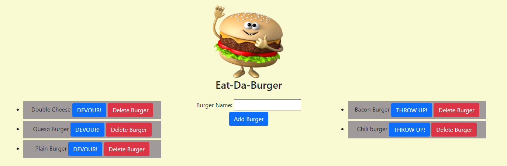
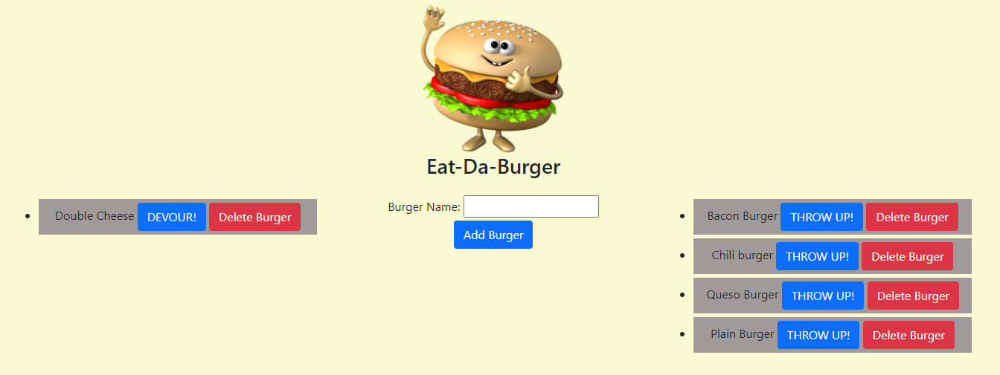

# Burger Express 

 - ### GitHub Link: https://github.com/greysonkirk/BurgerExpress
 - ### Heroku Link: https://arcane-everglades-71244.herokuapp.com/


 This is just a fun little app to "eat" hamburgers. The user can add a burger of their choice, then either DEVOUR it, delete it, or if they've had too much, throw it up!
 
 
 
The data is display using handlebars. 
 For example, the code below was for listing out each burger with a button next to it depending on the isEaten value.

 ```handlebars
<li>
	{{burger_name}}
	<button class="change-eat btn btn-primary btn-hover" data-id="{{id}}" data-newburger="{{isEaten}}">
		{{#if isEaten}}DEVOUR!{{else}}THROW UP!{{/if}}
	</button>
	<button class="delete-burger btn btn-danger btn-hover" data-id="{{id}}" >
		Delete Burger
	</button>
</li>
```

The data in this app is stored in a MySql database and is manipulated using JavaScript. 
For example the code below shows adding a burger to the DB using the post method. 

```javascript
router.post("/api/burgers", function(req, res) {
    burger.create([
        "burger_name"
    ], [
        req.body.burger_name
    ], function(result) {
        // Send back the ID of the new quote
        res.json({ id: result.insertId });
    });
});
```

ORM's were also used for this app. 

```js
    all: function(tableInput, cb) {
        var queryString = "SELECT * FROM " + tableInput + ";";
        connection.query(queryString, function(err, result) {
            if (err) {
                throw err;
            }
            cb(result);
        });
    },
```



